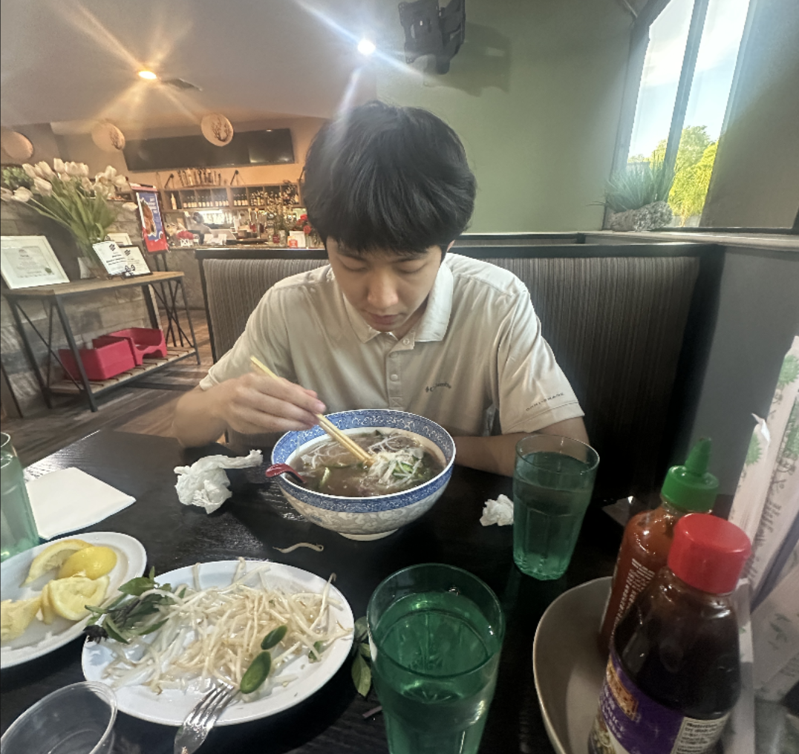

# Yannis Smith's User Page

## About Me

Hey! I'm Yannis (aka Ywreckz), a CS student at UC San Diego.
I've also studied abroad at Seoul National University, which was
an awesome experience. Outside of coding, I'm into chatting, 
games, and staying active.

> "Build things, break things, learn from both."



## Navigation
- [About Me](#about-me)
- [Skills](#skills)
- [Projects](#projects)
- [Interests](#interests)

## Skills

**Languages:**
- Python, Java, C++, JavaScript, SQL, Bash

**Tools I use:**
- Git, Docker, Linux, Jupyter Notebooks

*Always picking up something new.*

## Projects

### Luxury Car Depreciation Analysis
Crunched data on 420,000+ car observations to figure out what
actually makes a luxury car hold its value. Spoiler: condition
matters more than the brand.

### Weakly Supervised Stitching Networks
Computer vision project where I reduced video jitter and color
artifacts using a temporal smoothing layer. Lots of fun with
frame-by-frame math.

### CyberPatriot
Captained a cybersecurity team to  national finals

Connect w/ me on [LinkedIn](https://linkedin.com/in/ysmithy).

## Interests

1. Video Games
2. Badminton
3. Machine learning
4. Cybersecurity

- [x] Studied abroad in Seoul
- [ ] Contribute to a major open source project
- [ ] Build something people actually use every day

## More

Here's my [README](README.md) if you want to start from the top.

[Is this tuff?](20260325_214611.jpg)

Here's a quick Python snippet I think about a lot:
```python
def keep_going(obstacles):
    return [o for o in obstacles if not o.stopped_me()]
```